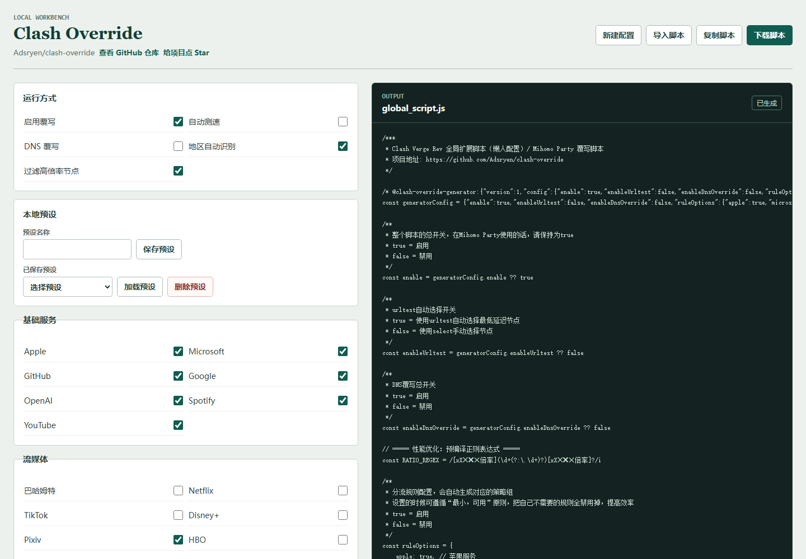

# Clash Override 使用与配置教程

本教程说明如何接入 `global_script.js`、使用本地生成器，以及手写配置时可调整的主要选项。

## 快速开始

### 直接下载

下载 [global_script.js](../../global_script.js)，或使用以下命令：

```bash
curl -O https://github.com/Adsryen/clash-override/raw/main/global_script.js
```

### Clash Verge Rev

1. 打开 Clash Verge Rev。
2. 进入 **设置** -> **配置** -> **全局扩展脚本**。
3. 导入下载的 `global_script.js`，或填入脚本在线地址。
4. 保存并重启 Clash Verge Rev。

### Mihomo Party

1. 打开 Mihomo Party。
2. 进入 **覆写** -> **脚本覆写**。
3. 导入 `global_script.js`，或填入脚本在线地址。
4. 确保脚本总开关 `enable` 为 `true`，然后保存并应用配置。

## 生成器使用

打开 [在线生成器](https://adsryen.github.io/clash-override/) 即可使用，不需要安装 Node.js。所有选项、草稿、预设和生成结果只保存在当前浏览器，不会上传到服务端。



### 生成与下载

在页面调整开关、地区选项或自定义规则后，可选择：

- **复制脚本**：复制普通 `global_script.js`。
- **下载脚本**：下载可读、便于排查问题的 `global_script.js`。
- **下载压缩版**：在浏览器本地压缩后下载 `global_script.min.js`，适合希望减少订阅拉取体积的场景。

压缩版保留生成器的版本化配置标记，因此也可以通过 **导入脚本** 恢复到页面继续编辑。压缩只减少文件体积，对 Clash/Mihomo 的实际规则逻辑没有区别；排查问题时建议优先使用普通版。

### 备份与恢复

- **导出配置** 会下载只包含当前生成器选项的 JSON 文件。
- **导入配置** 可在其他浏览器或设备恢复该 JSON 文件。
- **导入脚本** 只接受本生成器输出且带有版本化标记的脚本；手写 JavaScript 不会被解析或修改。
- **恢复默认** 会在确认后覆盖当前草稿。

草稿、最近一次生成结果和命名预设保存在浏览器的 `localStorage`。清除站点数据会删除它们；配置 JSON 不包含浏览器中的预设。

### 本地运行生成器

在仓库根目录执行：

```bash
cd generator
npm install
npm run local
```

需要 Node.js 18 或更新版本。开发服务器只监听 `127.0.0.1`。

## 配置说明

### 基础开关

```javascript
const enable = true
const enableUrltest = true
const enableDnsOverride = false
```

- `enable`：脚本总开关，Mihomo Party 请保持为 `true`。
- `enableUrltest`：`true` 使用 URL-Test 自动选择低延迟节点，`false` 使用手动选择。
- `enableDnsOverride`：是否启用 DNS 覆写。

### 分流规则

在 `ruleOptions` 中启用或禁用需要的服务：

```javascript
const ruleOptions = {
  apple: true,
  microsoft: true,
  github: true,
  google: true,
  openai: true,
  spotify: true,
  youtube: true,
  netflix: false,
  telegram: false,
  games: true,
  ads: true,
  russia: true,
}
```

### 地区配置

```javascript
const regionOptions = {
  excludeHighPercentage: true,
  autoDetect: true,
  regions: [
    {
      name: 'HK香港',
      regex: /港|香港|HONG KONG|hk|HK/i,
      ratioLimit: 5,
      icon: '...',
    },
  ],
}
```

- `excludeHighPercentage`：排除超过地区倍率限制的节点。
- `autoDetect`：根据节点名称自动识别地区。

### 自定义规则

在线生成器中，规则名称必须以英文字母开头，且只能使用字母、数字或连字符，例如 `gamingSites`。为规则选择目标策略组，并在域名后缀、关键词、精确域名、进程名或规则集输入框中每行填写一项。

手写配置结构如下：

```javascript
const customRules = {
  gamingSites: {
    target: '游戏专用',
    domainSuffix: ['example.jp'],
    domainKeyword: ['japan'],
    domain: [],
    processName: [],
    ruleSets: [],
  },
}
```

生成器不能使用 `direct`、`defaultProxy` 等内置规则名称，也不会复制整份内置规则。需要调整内置规则时，直接修改 [`global_script.js`](../../global_script.js)。

### DNS 配置

```javascript
const defaultDNS = ['tls://1.12.12.12', 'tls://223.5.5.5']
const chinaDNS = ['223.6.6.6', '119.29.29.29', '223.5.5.5']
const foreignDNS = [
  'https://120.53.53.53/dns-query',
  'https://223.5.5.5/dns-query',
]
```

## 使用技巧与故障排查

### 最小可用原则

只启用需要的分流规则。例如不使用 Netflix 时保持 `netflix: false`，可减少不必要的策略组和规则。

### 倍率过滤

机场包含高倍率节点时，保持 `excludeHighPercentage: true`，并按需要修改地区的 `ratioLimit`。

### 脚本不生效

1. 检查 `enable` 是否为 `true`。
2. 确认配置中至少包含一个可用代理节点。
3. 查看客户端日志中的脚本错误。

### 节点分组不正确

1. 检查节点名称是否符合地区正则表达式。
2. 调整 `regionOptions.regions` 内的 `regex`。
3. 启用 `autoDetect` 自动识别。

### DNS 解析问题

1. 检查 `enableDnsOverride` 是否启用。
2. 确认 DNS 服务器地址有效。
3. 检查 `nameserver-policy` 的分流配置。
